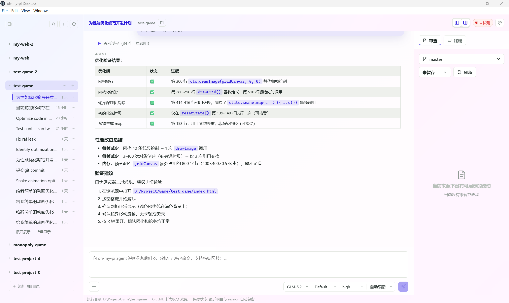

# oh-my-pi Desktop

oh-my-pi 的桌面端客户端 —— 一个**对话型 AI Agent 工作台**。

用户在中间工作区与所选模型对话，agent 通过 `omp acp` 子进程辅助完成编码任务：读写文件、执行命令、审查 diff、管理 Git 分支。

当前版本 `0.1.0`，主要面向 Windows 平台。



## 功能特性

- **三栏工作台布局**：左侧全高项目栏 + 中间对话区 + 右侧上下文栏（审查 / 终端输出）
- **富内容对话**：支持文本 + 图片粘贴/拖入，slash 命令面板，计划与工具调用结构化卡片
- **多 session 隔离**：按 sessionId 分桶，消息流、权限弹窗、elicitation 互不串扰
- **session 生命周期管理**：新建 / 加载 / 恢复 / Fork / 关闭 / `/resume` 同步
- **VS Code 风格 diff 审查**：单栏行内增删高亮，支持本地 Git 分支列表查看与切换
- **ACP 协议完整接入**：双层审批门控（权限弹窗 + elicitation/questionnaire 表单）、模型/模式/推理强度实时切换
- **会话审批策略**：always-ask / write / yolo 三档运行时切换
- **项目组织**：置顶 / 折叠 / 拖拽调宽 / 自定义显示名 / 全局会话搜索（`Ctrl+K` / `⌘+K`）

## 前置依赖

- **Node.js** >= 22.12.0（Electron 42 要求）
- **omp CLI**（已在 `v16.4.8` 上验证）— [oh-my-pi](https://github.com/can1357/oh-my-pi) 的命令行工具，需确保 `omp acp --help` 可正常执行。当前桌面端使用的omp非原版omp，后续会考虑开源。原版omp ACP存在一些问题。

## 快速开始

```bash
# 安装依赖
npm install

# 启动开发模式（Vite dev server + Electron）
npm run dev
```

开发模式下 Vite 在 `127.0.0.1:5173` 提供热更新，Electron 窗口自动加载该地址。

```bash
# 构建生产产物
npm run build

# 运行构建后的应用
npm start

# 打包 Windows 便携版
npm run dist:win
```

## 架构

```
┌──────────────┐  preload bridge  ┌──────────────────┐
│   Renderer   │ ───────────────► │  Main process    │
│  (React 19)  │ ◄─────────────── │  (NodeNext TS)   │
│  App.tsx     │  agent:event     │  agentService.ts │
└──────────────┘                  └────────┬─────────┘
                                           │ spawn('omp', ['acp'])
                                           ▼
                                  ┌──────────────────┐
                                  │  omp acp child   │
                                  │  stdio JSON 行    │
                                  └──────────────────┘
```

- **主进程**：管理 agent 子进程生命周期、权限审批、状态持久化（JSON 文件）
- **渲染进程**：React 19 三栏 UI，通过 33 个 IPC 通道与主进程通信
- **agent 子进程**：`omp acp`，通过 stdio JSON-RPC 与主进程交互

## 技术栈

| 层 | 技术 |
|---|---|
| 桌面框架 | Electron 42 |
| 前端 | React 19 + TypeScript 5.9 |
| 构建 | Vite 7 |
| Markdown 渲染 | react-markdown + remark-gfm + rehype-highlight |
| 打包 | electron-builder（Windows portable） |

## 目录结构

```
src/
├── electron/                 # 主进程
│   ├── main.ts               # 应用入口
│   ├── window.ts             # BrowserWindow 工厂
│   ├── preload.ts            # contextBridge（33 invoke + 1 事件通道）
│   ├── ipc.ts                # IPC handler 注册
│   ├── agentService.ts       # agent 子进程管理与 JSON-RPC 解析
│   ├── state.ts              # JSON 持久化
│   ├── command.ts            # 通用子进程执行器
│   └── types.ts              # 主进程类型定义
├── renderer/                 # 渲染层
│   ├── main.tsx              # React 入口
│   ├── App.tsx               # 根组件（三栏布局 + 状态管理）
│   ├── types.ts              # 渲染层类型定义
│   ├── utils.ts              # 工具函数
│   ├── diffParser.ts         # Git diff 解析器
│   ├── styles.css            # 全局样式
│   └── components/           # UI 组件
│       ├── TopBar.tsx        # 顶部应用栏
│       ├── ProjectPane.tsx   # 左侧项目栏
│       ├── ChatWorkspace.tsx # 中间对话区
│       ├── ContextPane.tsx   # 右侧上下文栏
│       ├── StatusBar.tsx     # 底部状态栏
│       ├── PermissionModal.tsx
│       ├── ElicitationModal.tsx
│       ├── QuestionnaireModal.tsx
│       ├── ReviewDiffView.tsx
│       ├── ModelPickerPopover.tsx
│       ├── SegmentSelect.tsx
│       ├── SessionSearchModal.tsx
│       └── GitBranchSwitchErrorModal.tsx
└── vite-env.d.ts             # 跨进程共享类型（需与 electron/types.ts 同步维护）
```

## 开发

```bash
npm run dev       # 开发模式
npm run build     # 类型检查 + 构建
npm start         # 运行构建产物
npm run preview   # 仅渲染层预览
```

修改公共类型时注意：`src/electron/types.ts` 与 `src/vite-env.d.ts` 中的同名类型需同步更新。

## 许可证

本项目基于 [MIT 协议](LICENSE) 开源。
